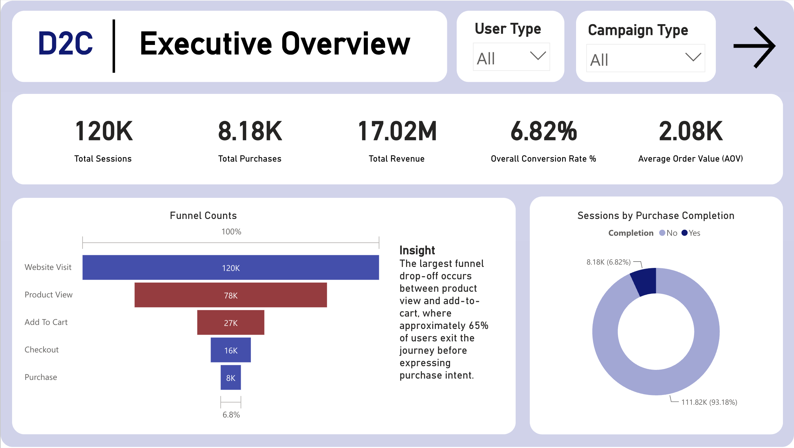
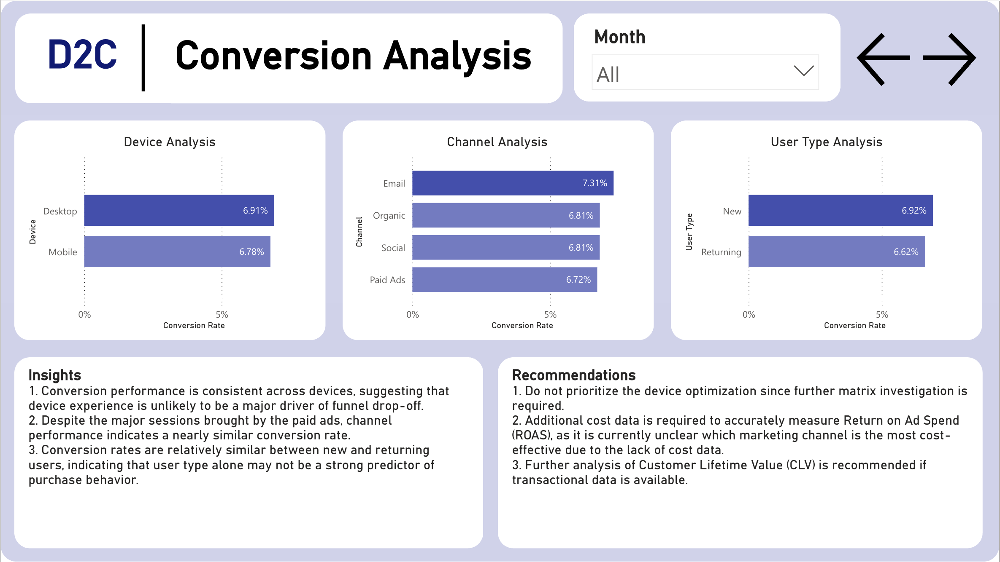

# E-Commerce Funnel Analysis
### Direct-to-Consumer | SQL | Power BI | DAX | Excel | Python

## 1. Overview
Analyzed an e-commerce conversion funnel to identify where customers drop off in the purchase journey and evaluate how channel, device, and user type affect conversion performance and revenue generation.

---

## 2. Business Problem
For e-commerce businesses, traffic alone does not guarantee revenue growth. The more important question is how efficiently visitors move through the funnel from website visit to product exploration, cart addition, checkout, and purchase.

This project was designed to answer the following stakeholder questions:

- Where is the biggest drop-off in the customer purchase funnel?
- What is the overall conversion rate from session to purchase?
- Do conversion rates differ across acquisition channels, devices, or user types?
- Which marketing channels generate the most revenue and the highest conversion efficiency?
- What should the business prioritize to improve conversion performance?

---

## 3. Tools & Process

### SQL
- Validated the e-commerce session-level dataset and built KPI summaries for total sessions, purchases, revenue, conversion rate, and average order value (AOV)
- Calculated funnel-stage volumes from **website visit → product view → add to cart → checkout → purchase**
- Measured conversion performance by **channel**, **device**, **user type**, and **region**
- Evaluated discount-related purchase behavior and revenue contribution
- Built monthly summaries to monitor traffic, purchases, and revenue trends over time

### Python
- Used for basic data inspection before analysis, including checking table structure, data types, missing values, duplicates, and summary statistics

### Power BI
- Built an interactive dashboard to track funnel performance and segment conversion rates across different customer and marketing dimensions
- Designed an executive funnel page to visualize overall funnel efficiency and purchase completion distribution
- Created comparison visuals for conversion rate by **device**, **channel**, and **user type**
- Used dashboard storytelling to move from funnel monitoring into performance diagnosis and business recommendations

---

## 4. Key Findings

- The dataset contains **120,000 sessions**, which generated **8,181 purchases** and **$17.02M in revenue**.
- The largest funnel drop-off occurred between **Product View** and **Add to Cart**. Out of **77,870 product viewers**, only **27,156** added items to the cart, meaning approximately **65% of users dropped off before showing purchase intent**.
- Funnel performance remained relatively stable across customer segments. **Mobile** converted at **6.78%** and **Desktop** at **6.91%**, suggesting that device experience is unlikely to be a major driver of funnel drop-off.
- Conversion rates were also similar across acquisition channels. **Paid Ads** converted at **6.72%**, **Organic** at **6.81%**, **Social** at **6.81%**, and **Email** performed slightly better at **7.31%**.
- Despite similar conversion efficiency, **Paid Ads** generated the highest business impact because it drove the largest traffic volume, producing **53,891 sessions**, **3,619 purchases**, and **$7.54M in revenue**.
- **New users** converted at **6.92%**, only slightly above **Returning users** at **6.62%**, indicating that user type alone is not a strong differentiator of purchase behavior in this dataset.
- Monthly performance was relatively consistent across the six-month period, with total revenue ranging from **$2.54M to $2.99M** per month and purchases ranging from **1,231 to 1,437**, suggesting stable funnel performance rather than sharp seasonality-driven spikes.

---

## 5. Dashboard Preview

### Interactive Dashboard

Explore the live Power BI dashboard here:

[Open Interactive Power BI Dashboard](https://app.powerbi.com/reportEmbed?reportId=866fe349-c88d-4465-89b8-4aca53da6579&autoAuth=true&ctid=fe3fbfc3-740c-40d3-a502-14423e1ca052&actionBarEnabled=true)

### 1) Executive Overview


---

### 2) Conversion Analysis


---

## 6. Recommendations

### 1) Prioritize investigation of the Product View → Add to Cart drop-off
The most significant loss in the funnel occurs between product browsing and cart addition. This suggests that the business should focus on improving the product evaluation stage by investigating factors such as:
- product page clarity and content quality
- pricing visibility and discount communication
- trust signals such as reviews, delivery information, and return policy visibility
- call-to-action placement and product-page usability

### 2) Do not prioritize device optimization as the first conversion initiative
Since **Mobile** and **Desktop** conversion rates are highly similar, device type does not currently appear to be a major source of funnel inefficiency. Device optimization may still be useful, but it should not be the first priority compared with product-page and add-to-cart optimization.

### 3) Evaluate marketing channels using cost data, not conversion rate alone
Although conversion rates are similar across channels, their business value may differ significantly once acquisition cost is considered.  
To make channel decisions more accurately, the business should incorporate:
- advertising spend by channel
- customer acquisition cost (CAC)
- return on ad spend (ROAS)

Without cost data, it is not possible to determine which channel is the most cost-effective.

### 4) Use Paid Ads as a scale lever, but validate profitability
**Paid Ads** currently generate the largest share of sessions, purchases, and revenue. However, this does not automatically mean they are the best-performing channel from a profitability perspective. The business should compare paid traffic revenue against campaign cost before increasing budget allocation further.

### 5) Extend the analysis with customer value metrics if transaction history is available
This dataset is strong for funnel analysis, but not for long-term customer value analysis. If customer-level transaction history becomes available, the next step should be to analyze:
- repeat purchase behavior
- customer lifetime value (CLV)
- retention differences between new and returning users
- channel-level customer quality, not just first-purchase conversion

---

## 7. Repository Structure

```text
ecommerce-funnel-analysis/
│
├─ README.md
├─ sql/
│  ├─ kpi_summary.sql
│  ├─ funnel_overview.sql
│  ├─ stage_conversion_rates.sql
│  ├─ performance_by_campaign.sql
│  ├─ performance_by_channel.sql
│  ├─ performance_by_device.sql
│  ├─ performance_by_user_type.sql
│  ├─ performance_by_region.sql
│  ├─ discount_impact.sql
│  └─ monthly_performance_trend.sql
│
├─ powerbi/
│  └─ ecommerce_funnel_dashboard.pbix
│
├─ assets/
│  ├─ executive-overview.png
│  └─ conversion-analysis.png
│
└─ docs/
   └─ business_questions.md
```

---

## 8. Skills Demonstrated
- E-commerce funnel analysis
- Conversion rate analysis
- Funnel stage drop-off analysis
- Channel, device, and user segmentation
- SQL KPI aggregation and funnel reporting
- Python basic data inspection
- Power BI dashboard storytelling
- Translating funnel insights into business recommendations
